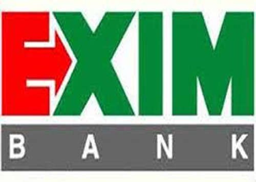
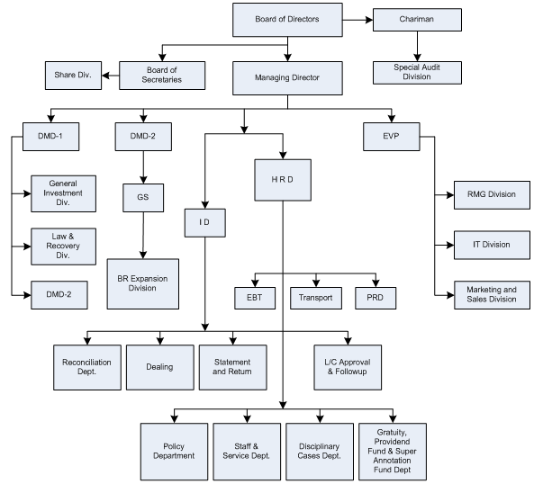

Chapter 2
*********

About Export Import Bank of Bangladesh Ltd.
===========================================

2.1 Background 
--------------
Export Import Bank of Bangladesh Limited was established in the year
1999 under the leadership of Late Mr. Shahjahan Kabir, Founder Chairman who had a long dream of floating a commercial bank which would
contribute to the socio-economic development of our country. He had
a long experience as a good banker. A group of highly qualified and
successful entrepreneurs joined their hands with the founder chairman to materialize his dream. Indeed, all of them proved themselves
in their respective business as most successful star with their endeavor,
intelligence, hard working and talent entrepreneurship. Among them,
Mr. Nazrul Islam Mazumder who is an illuminated business tycon
in the Garments business in Bangladesh became the Honorable Chairman after the demise of the honorable founder chairman. He is also the
chairman of Bangladesh Association of Banks (BAB). Under his leadership, BAB has emerged as an effective forum for exchanging views
on problems being faced by the banking sector of Bangladesh and for
formulating common policy guidelines in addressing such problems.

The Bank starts functioning from 3rd August, 1999 with its name
as Bengal Export Import Bank Limited. On 16th November 1999,
it was renamed as Export Import Bank of Bangladesh Limited with Mr. Alamgir Kabir as the Founder Advisor and Mr. Mohammad
Lakiotullah as the Founder Managing Director respectively. Both of
them have long experience in the financial sector of our country. By
their pragmatic decision and management directives in the operational
activities, this bank has earned a secured and distinctive position in
the banking industry in terms of performance, growth, and excellent
management. Under the leadership of Mr. Lakiotullah, the Bank has
migrated all of its conventional banking operation into Shariah Based
Islami Banking in the year July 2004.

In the year 2006, Mr. Kazi Masihur Rahman became the Managing
Director of the bank when Mr. Lakiotullah left the bank after completion of his successful 7 years as MD. Mr. Kazi served in the bank for
next five years. Under his leadership, the bank has been placed on a
state of the art centralized IT platform with two modern data centers
where world renowned core banking software TEMENOS T24 is running along with some alternate delivery channels like ATM and SMS
banking.

On 25th August, 2011, Mr. Md. Fariduddin Ahmed has joined in the
bank as Managing Director. With his long banking experience, EXIM
Bank become fully compliant Bank with adequate capital and good
asset quality. After retirement from Managing Director, he has been
continuing his service for EXIM Bank as Advisor since 27th July 2012.

Dr. Mohammed Haider Ali Miah succeeded Mr. Fariduddin Ahmed
on July 25, 2012 and has created a new dimension in EXIM history becoming the first ever in-house Managing director and CEO of the Bank.
Under his far-sighted leadership, EXIM Bank has not only achieved
uppermost level of performance in almost each arena of its activities
but also gained confidence to place itself as one of the dynamic banks
through delivering transparent and standard banking services to the
customers in a compliant manner. [1]

2.1.1 Vision and Mission
-------------------------

Our vision and mission are stated in the following:
  • To be the finest bank in the banking arena of Bangladesh under the Shariah Guidelines. To maintain Corporate and business ethics.
  • To become a trusted repository of customers’ money and their financial advisor.
  • To make our stock superior and rewarding to the customers/share holders.
  • To display team spirit and professionalism.
  • To have a Sound Capital Base.
  • To provide high quality financial services in export and import trade.
  • To provide excellent quality Customer service.

   [Figure 2.1] Official logo of EXIM Bank of Bangladesh Limited

2.1.2 Corporate culture
-----------------------
This bank is one of the most disciplined Banks with a distinctive corporate culture. Here we believe in shared meaning, shared understanding and shared sense making. Our people can see and understand
events, activities, objects and situation in a distinctive way. They adapt
their manners and etiquette, character individually to suit the purpose
of the Bank and the needs of the customers who are of paramount
importance to us. The people in the Bank see themselves as a tight
knit team/family that believes in working together for growth. The
corporate culture we belong has not been imposed; it has rather been
achieved through our corporate conduct. [2]

2.1.3 Social commitment
-----------------------
The purpose of our banking business is, obviously, to earn profit, but
the promoters and the equity holders are aware of their commitment
to the society to which they belong. A chunk of the profit is kept aside
and/or spent for socio-economic development through trustee and in
patronization of art, culture and sports of the country. We want to
make a substantive contribution to the society where we operate, to
the extent of our separable resources. [3]

2.1.4 Achievement
-----------------
It is a great pleasure that by the grace of Almighty Allah, we have
migrated at a time all the branches from its conventional banking
operation into Shariah based Islami banking Operation without any
trouble. Lot of uncertainties and adversities were there into this migration process. The officers and executives of our bank motivated the
valued customers by counseling and persuasion in light with the spirit
of Islam especially for the non-Muslim customers. Our IT division
has done the excellent job of converting and fitting the conventional
business processes into the processes based on Shariah. [4]
10

2.1.5 Shariah Board
-------------------

The Board of directors has formed a Sharia Supervisory Board for
the Bank. Their duty is to monitor the entire Bank’s transactional
procedures, & assuring its Sharia compliance. This Board consists
of the following members headed by its Chairman. The tasks of the
Sharia supervisor in summary is replying to queries of the Bank’s
administration, staff members, shareholders, depositors, & customers,
follow up with the Sharia auditors and provide them with guidance,
submitting reports & remarks to the Fatwa & Sharia Supervision Board
and the administration, participating in the Bank’s training programs,
participating in the supervision over the AlIqtisad AlIslami magazine,
& handling the duty of being the General Secretary of the Board. [5]

2.1.6 Shariah Auditing
-----------------------

This is the civil supervisory aspect that shapes the Bank’s main feature.
Its existence is part of the Sharia Supervision procedures. One of its
main tasks is to check the Sharia compliance in the Bank’s transactional
procedures in accordance to the Fatwas issued in that regard under the
guidance of Shariah Supervisor. The Sharia auditor is assigned the task
of revising the Bank’s transactional procedures throughout the year to
check the extent to which the staff members and the different departments have abided by the regulations, advices, and Fatwas issued by
the Fatwa & Sharia Supervision Board, forums, & banking conferences.
As well as, assuring that all the contracts that states a right for the Bank
or an obligation on the Bank is certified by The Fatwa & Sharia Supervision Board. Moreover, the Sharia Auditing submits periodic reports
to the Sharia Supervisor in order to be proposed to the Fatwa & Sharia
Supervision Board to state what it finds appropriate in that regard.

2.2 Functional Organogram of EXIM Bank Limited Bangladesh(Head Office)
----------------------------------------------------------------------

   [Figure 2.2] Functional Chart of EXIM Bank of Bangladesh Limited

2.3 Banking with Shariah Principles
-----------------------------------
Export Import Bank of Bangladesh Limited is the 1st bank in Bangladesh
who has converted all of its operations of conventional banking into
shariah-based banking since July 2004. We offer banking services for
Muslims and non-Muslims alike allowing our customers choice and
flexibility in their savings and investments. Our products are approved
by our Shariah Board comprising of veteran Muslim scholars of our
country who are expert in all matters of Islamic finance.

The process by which Noriba’s investments are designed and executed
allows the Bank to offer a combination of Sharia compliance and capital markets expertise. Noriba is committed to the strict adherence to
the requirements of the Sharia as a result of the Bank’s sole focus on
Sharia-compliant investments and the full supervision of its financial
products and transactions by the Noriba Sharia Board. Noriba experts
specifically design each of the Bank’s investment vehicles with the
approval of the Noriba Sharia Board. Once the given product or transaction has been arranged, the Noriba Sharia Board carefully screens
it for compliance before giving final approval for its implementation.
This control mechanism guarantees that all aspects of Noriba’s final
products and banking transactions are in adherence with the guidelines of the Sharia.

2.4 Banking Operation
---------------------

2.4.1 Bank Operational Area
---------------------------

Export and Import Trade Handling and Financing

As a commercial Bank, we do all traditional Banking business including the wide range of savings and credit scheme products, retail
banking and ancillary services with the support of modern technology and professional Excellency. But our main focus is, for obvious
reason, on export and import trade handling and the development of
entrepreneurship and patronization of private sectors.[6]

2.4.2 Product and Services
--------------------------
  • Super Savings Scheme Monthly Savings
  • Scheme Monthly Income Scheme
  • Multi plus Savings Hajj Deposit

2.4.3 Investment / Finance
--------------------------

  • Corporate Finance
  • Industrial Finance
  • Project Finance

2.4.4 Syndicate Investment Mode of Investment
---------------------------------------------

  • Murabaha Quard
  • Bai Muazzal Local Documentary Bill Purchased
  • Izara Bil Baia Foreign Documentary Bill Purchased
  • Wazirat Bil Wakala

2.4.5 Deposit
-------------

  • Al-Wadia Current Deposit
  • Mudaraba Savings Deposit
  • Mudaraba Short Term Deposit

2.4.6 Mudaraba Term Deposit
---------------------------
  • One Month Twelve Months
  • Three Months Twenty Four Months
  • Six Months Thirty Six Months

2.4.7 Mudaraba Savings Scheme
-----------------------------
  • Monthly Savings Scheme (Money Grower)
  • More than triple the Deposit in 10 years (Multi plus Savings)
  • Monthly Income Scheme (Steady Money) Mudaraba Hajj Deposit
  • More than double the deposit in 6 years (Super Savings)

We emphasize on non-fund business and fee based income. Bid bond/
bid security can be issued at customer’s request. Our Bank is posed
to extend L/C facilities to its importers / exporters through establishment of correspondent relations with leading banks all over the world.
Moreover, Consumers can deposit their Telephone bill of GrameenPhone in all the branches except Motijheel and the consumers of Palli
Buddut somity of Gazipur can deposit their electricity bill to Gazipur
branch.

2.4.8 E cash/ ATM Service
-------------------------
The bank is currently providing Credit Card Service (MasterCard) to
the privileged customers of the bank in collaboration of Prime Bank.
Floating VISA card for both Debit and Credit card service is under
process.

2.5 Society for Worldwide Interbank Financial Telecommunication (SWIFT)
-----------------------------------------------------------------------

BANK IDENTIFICATION CODE (BIC):
EXBKBDDH
  • MOTIJHEEL BRANCH EXBKBDDH001
  • PANTHAPATH BRANCH EXBKBDDH002
  • PANTHAPATH BRANCH EXBKBDDH002
  • AGRABAD BRANCH EXBKBDDH003
  • KHATUNGANJ BRANCH EXBKBDDH004
  • IMAMGANJ BRANCH EXBKBDDH006
  • GULSHAN BRANCH EXBKBDDH007
  • NAWABPUR BRANCH EXBKBDDH010
  • NARAYANGONG BRANCH EXBKBDDH011
  • RAJUK AVENUE BRANCH EXBKBDDH013
  • UTTARA BRANCH EXBKBDDH015
  • JUIBLEE ROAD BRANCH EXBKBDDH018
  • MIRPUR BRANCH EXBKBDDH017
  • KARWAN BAZAR BRANCH EXBKBDDH035
  • BOGRA BRANCH EXBKBDDH021 [7]

