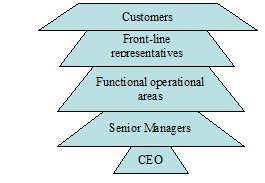

Chapter 3
*********

Customer Service for General Banking and My Understanding
=========================================================
The most important asset of any organization is its customers. An organization’s success depends on how many customers it has, how much they buy, and how often they buy. Customers that are satisfied will increase in number, buy more, and buy more frequently. Satisfied customers also pay their bills promptly, which greatly improves cash flow-the lifeblood of any organization. The organizational diagram in Figure-1 best exemplifies just how important the customer is to any organization

   
   [Figure 3.1] Customer Satisfaction Organizational Diagram

A company is a device for transforming inputs into outputs. The simplest measure of efficiency is the quantity of inputs that it takes to produce a given output; that is, Efficiency = outputs/inputs.

A company can increase efficiency through a number of steps. These include exploiting economies of scale and learning effects, adopting flexible manufacturing technologies, reducing customer defection rates, getting R&D function to design products that are easy to manufacture, upgrading the skills of employees through training, introducing self-managing teams, linking pay to performance building a company wide commitment to efficiency through strong leadership, and designing structures that facilitate cooperation among different functions in pursuit of efficiency goals.

To achieve superior customer responsiveness often requires that the company achieve superior efficiency, quality, and innovation. To achieve superior customer responsiveness, a company needs to give customers what they want when they want it. It must ensure a strong customer focus, which can be attained through leadership; training employees to think like customers; bringing customers into the company through superior market research; customizing the product to the unique needs of individual customers or customer groups; and responding quickly to customers demands.

Customer’s satisfaction depends on Efficacy of customer service. If customers of the bank are satisfy on the banking service then the
efficacy will be positive. On the other hand, if customers are dissatisfy
then the efficacy will be negative.

Efficacy of customer service is related with progression of operation. We can identify the efficacy of customer service by studying the progress of EXIM Bank from starting to at present. The progress of EXIM Bank limited is very rapid with the concern of its profit making and growth of its operation within the country towards the country’s economy.

3.1 General Banking
-------------------

The main activities of general banking division are as follows;
   1. Accounts Opening.
   2. Issuing check books and account closing.
   3. Remittance.
   4. Clearing Department.
   5. General Enquiries.
   6. Customer complaints.
   7. ITS Department.

3.2 Credit/ Loan and Advance
----------------------------

EXIM bank provides various types of loan to individual and organizations. The main three type’s loans are;
   1. Cash credit,
   2. Consumer credit, and
   3. Security overcomes.

3.3 Foreign Exchange
--------------------

The department deals with export and Import activities are called foreign Exchange department. At the beginning of my internship work the Rajuk branch doesnt have foreign exchange license, so in that time they use the license of Motijheel branch gets the foreign exchange license. And they start the work from 1st June, 04. The widely used terms in this division are described briefly following:

3.4 Export
----------
When any organization/company want to sale any goods or services to the buyer in live in another country, is called export the goods/services. In this regard, the seller needs a Latter of Credit (L/C) from the buyer for the confirmation of payment.

3.5 Import
----------
When any organization/company want to buy any goods or services from the seller live on other country, is called import the goods/services. In this regard the buyer needs to open a Letter of Credit (L/C) to the name of seller’s company for the confirmation of payment.[8]

3.6 Letter of Credit (L/C)
--------------------------

The documentary credit is a commitment on the bank’s part to place an agreement at the seller’s disposal on behalf of the buyer under precisely defined conditions.

3.7 The terms Documentary Credit
--------------------------------

In actual practice, a number of different expressions have emerged for this type of business, all of which basically mean the same thing Documentary Letter of Credit, Commercial Letter of Credit, Letter of Credit, L/C. The main parties to documentary credit:
  1. Buyer (Importer).
  2. Seller (Exporter).
  3. L/C Issuing Bank (Buyer’s Bank).
  4. Advising Bank (Issuing bank correspondent at seller’s place).
  5. Negotiating Bank (Seller’s Bank). (Some time the advising bank and the negotiating bank become the same bank)

3.8 Other operations
--------------------

The bank does all traditional banking business including Islamic Banking services in selective branches.

  1. Deposits, which are the lifeblood for the bank, among the other modes, are mobilized through a variety of saving scheme. The bank also handles Traveler checks, Credit cards. Consumer credit facilities, Inland and foreign remittance of the fund and operates in the money market.
  2. In capital market operations, it engages itself in share and securities business, mutual fund management and brokerage house activities.
  3. Bank is poised to extend L/C facilities to its importer/exporter.
  4. Customers through establishment of correspondent relations and Nostro Accounts with leading Banks all over the world.
  5. The bank trades and commerce with added emphasis on foreign exchange. The bank also adopts Micro-credit and Agro-credit schemes.

3.9 Account Opening Section
---------------------------

Account opening is the gateway for clients to enter into business with bank. It is the foundation of banker customer relationship. This is one of the most important sections of a branch, because by opening accounts bank mobilizes funds for investment. Various rules and regulations are maintained and various documents are taken while opening an account. A customer can open different types of accounts through this department. Such as: [9]

3.9.1 Al- Wadia (Current) Account)
----------------------------------

Current account is purely a demand deposit account. There is no restriction on withdrawing money from the account. It is basically justified when funds are to be collected and money is to be paid at frequent interval. Some Important Points are as follows

  1. Minimum opening deposit of TK.1000/- is required;
  2. There is no withdrawal limit.
  3. No interest is given upon the deposited money;
  4. Minimum Tk.1000/= balance must always maintain all the time.

3.9.2 Mudaraba Savings (SB) Account
-----------------------------------

This deposit is primarily for small-scale savers. Hence, there is a restriction on withdrawals in a month. Heavy withdrawals are permitted only against prior notice. Some Important Points are as follows

  1. Minimum opening deposit of Tk.5000/= is required;
  2. Minimum Tk. 1000/= balance must always maintain all the time;
  3. Withdrawal amount should not be more than 1/4th of the total balance at a time and limit twice in a month.
  4. If withdrawal amount exceed 1/4th of the total balance at a time no interest is given upon the deposited money for that month.

3.9.3 Mudaraba Short Term Deposit (MSTD) Account
------------------------------------------------

Normally various big companies, organizations, Government Departments keep money in MSTD account. Frequent withdrawal is discouraged and requires prior notice. The deposit should be kept for at least seven days to get interest. The interest offered for MSTD is less than that of savings deposit. Interest is calculated based on daily minimum product and paid two times in a year.

3.10 Account Opening Procedure
------------------------------

+----------+----------------------------------------------------------------------+
|Step no   | Procedures                                                           |
+==========+======================================================================+
| Step 1   | The account should be properly introduced by Any one of the following|
+          +                                                                      +
|          |  • An existing Current Account holder of the Bank.                   |
+          +                                                                      +
|          |  • Officials of the Bank not below the rank of an Assistant officer. |
+          +                                                                      +
|          |  • A respectable person of the locality well known to the Manager    | 
+          +                                                                      +
|          |    or Sub-Manager of the Branch concerned.                           |
+----------+----------------------------------------------------------------------+ 
| Step 2   | Receiving filled up application in bank’s prescribed form mentioning |
+          +                                                                      +
|          | what type of account is desired to be opened                         |
+----------+----------------------------------------------------------------------+
| Step 3   |  • The form is filled up by the applicant himself/ herself           |
+          +                                                                      +
|          |  • Two copies of passport size photographs from individual are taken,| 
+          +                                                                      +
|          |    in case of firms photographs of all partners are taken            |
+          +                                                                      +
|          |  • Applicants must submit required documents                         |
+          +                                                                      +
|          |  • Application must sign specimen signature sheet and give mandate   |
+          +                                                                      +
|          |  • Introducer’s signature and accounts                               |
+          +                                                                      +
|          |    number - verified by legal officer                                |
+----------+----------------------------------------------------------------------+
| Step 4   | I Authorized Officer accepts the application                         |
+----------+----------------------------------------------------------------------+
| Step 5   | Minimum balance is deposited - only cash is accepted                 |
+----------+----------------------------------------------------------------------+
| Step 6   | I Account is open S and a Cheque book and pay-in-slip book is given  |
+----------+----------------------------------------------------------------------+

3.11 Documents required for opening account
-------------------------------------------

3.11.1 Individual / Joint Account
---------------------------------
  1. Introduction of the account.
  2. Two photographs of the signatories duly attested by the introducer.
  3. Identity (copy of passport).
  4. Joint Declaration Form (For joint a/c only).
  5. Employee’s Certificate (in case of service holder).

3.11.2 Partnership account
--------------------------
  1. Introduction of the account.
  2. Two photographs of the signatories duly attested by the introducer.
  3. Partnership letter duly signed by all partners (Sign should be similar as stated in Partnership Deed).
  4. Partnership Deed duly certified by Notary public.
  5. Registration (If any).
  6. Updated Trade license.

3.11.3 Proprietorship account
-----------------------------
  1. Introduction of the account.
  2. Two photographs of the signatories duly attested by the introducer.
  3. Valid copy of Trade License.
  4. Rubber stamp.
  5. TIN number certificate.
  6. Identity (Copy of passport).
  7. Permission letter from DC/ Magistrate (in case of newspaper)

3.11.4 Limited company
----------------------
  1. Introduction of the account.
  2. Two photographs of the signatories duly attested by the introducer.
  3. Valid copy of Trade License.
  4. Board resolution of opening A/C duly certified by the Chairman/Managing Director.
  5. Certificate of Incorporation.
  6. Certificate of Commencement (In case of Public limited company).
  7. Certified (joint stock) true copy of the Memorandum and Article of Association of the Company duly attested by Chairman or Managing Director.
  8. List of directors along with designation & specimen signature.
  9. Latest certified copy of Form xii (to be certified by register of joint stock companies) (In case of Directorship change).
  10. Rubber Stamp (Seal with designation of each person)
  11. Certificate of registration (In case of Insurance Company Obtained from department of Insurance from the Peoples Republic of BD).

3.11.5 Club/Societies account
-----------------------------
  1. Introduction of the account.
  2. Two photographs of the signatories duly attested by the introducer.
  3. Board Resolution for Opening A/C duly certified by President/ Secretary.
  4. List of Existing Managing Committee.
  5. Registration (if any).
  6. Rubber Stamp.
  7. Permission letter from Bureau of N.G.O.(In case of N.G.O. A/C).

3.12 Deposit Section
--------------------
Deposit is the lifeblood of a bank. From the history and origin of the banking system we know that deposit collection is the main function of a bank.

3.12.1 Accepting deposits
-------------------------
The deposits that are accepted by EXIM Bank of Bangladesh Limited like other banks may be classified in to, Demand Deposits

These deposits are withdrawn able without notice, e.g. current deposits. EXIM Bank of Bangladesh Limited accepts demand deposits through the opening of:
  1. Current account
  2. Savings account
  3. Call deposits from the fellow bankers

Time Deposits

A deposit which is payable at a fixed date or after a period of notice is a time deposit. EXIM Bank of Bangladesh Limited accepts time deposits through Fixed Deposit Receipt (FDR), Short Term Deposit (STD) and Bearer Certificate Deposit (BCD) etc. While accepting these deposits, a contract is done between the bank and the customer. When the banker opens an account in the name of a customer, there arise contracts between the two. This contract will be valid one only when both the parties are competent to enter into contracts. As account opening initiates the fundamental relationship & since the banker has to deal with different kinds of persons with different legal status, EXIM Bank of Bangladesh Limited officials remain very much careful about the competency of the customers.

3.12.2 Fixed Deposit
--------------------

The Local Remittance section of EXIM Bank of Bangladesh Limited also issues FDR. They are also known as time deposit or time liabilities. These are deposits, which are made with the bank for a fixed period, specified in advance. The bank need not maintain cash reserves against these deposits and therefore, the bank offers higher of interest on such deposits.

3.13 Opening of fixed Deposit Account
-------------------------------------

The depositor has to fill an account form where in the mentions the amount of deposit, the period for which deposit is to be made and name/names is which the fixed deposit receipt is to be issued. In case of a Joint name EXIM Bank of Bangladesh Limited also takes the instructions regarding payment of money on maturity of the deposit. The banker also takes specimen signatures of the depositors. A fixed deposit account is then issued to the depositor acknowledging receipt of the sum of money mentioned there. It also contains the rate of interest and the date on which the deposit will fall due for payment.

3.14 Payment of interest
------------------------
It is usually paid on maturity of the fixed deposit. EXIM Bank of Bangladesh Limited calculates interest at each maturity date and provision is made on that miscellaneous creditor expenditure payable accounts is debited for the accrued interest.

3.15 FDR
--------
In case of premature FDR EXIM Bank of Bangladesh Limited is not bound to accept surrender of the deposit before its maturity date. In order to deter such a tendency the interest on such a fixed deposit is made cut a certain percentage less the agreed rate. Normally savings bank deposit is allowed. In case of lost of FDR the customer is asked to record a GD (general diary) in the nearest police station. After that the customer has to furnish an Indemnity Bond to EXIM Bank of Bangladesh Limited a duplicate FDR is then issued to the customer by the bank. EXIM Bank of Bangladesh Limited the instrument is automatically renewed within seven days after the date of its maturity if the customer does not come to encase the FDR.

3.16 Cash Section
-----------------
Banks, as a financial institution, accept surplus money from the people as deposit and give them opportunity to withdraw the same by cheque, etc. But among the banking activities, cash department play an important role. It does the main function of a commercial bank i.e. receiving the deposit and paying the cash on demand. As this department deals directly with the customers, the reputation of the bank depends much on it. The functions of a cash department are described bellow:

3.17 Function of the cash department
------------------------------------

3.17.1 Cash Payment
-------------------
  1. Cash payment is made only against cheque.
  2. This is the unique function of the banking system which is known as payment on demand
  3. It makes payment only against its printed valid Cheque.

3.17.2 Cash Receipt
-------------------
  1. It receives deposits from the depositors in form of cash.
  2. So it is the mobilization unit of the banking system.
  3. It collects money only its receipts forms.

3.17.3 Cash packing
-------------------
After the banking hour cash is packed according to the denomination. Notes are counted and packed in bundles and stamped with initial.

3.18 New Product Development
----------------------------
The new product can be developed in new market or existing market. New product can also be launched in improved market or in the new market. Innovation a product essentially means developing a product resulting in an increase in the product line. These enable diversifying business risks,
continuing life cycle of a product and also ensures profits.

3.18.1 Mudaraba
---------------
Mudaraba means the hiring of capital. It is a contract in a profit sharing where one party provides capital/funds and the other labor/work. Under
this system, banks provide the capital and clients provide expertise and profit is shared according to agreed ratio.

3.18.2 Musharaka
----------------

This mode of finance is represented by two or more financiers in contributions of equal or unequal ratios of capital to establish a new project or to
participate in an established one and all partners are entitled to share the total profits of the venture according to ratio as mutually agreed upon allowing for managerial skills to be remunerated.

3.18.3 Murabaha
---------------

About 70 to 80 percent of financial operations of most of the Islamic banks belong to this segment. It enables the investor to obtain finished goods, raw materials, machinery or equipment from the local market or through import by opening letter of credit (L/C). Under this technique, bank buys the goods upon the request of the client and then the customer form the bank purchases these goods with a fixed period of time or by installment with a cost, which includes cost of goods plus mark-up profit.

3.18.4 Ijarah
-------------
Izarah financing under Islamic Shariah is same as the western concept of leasing. In Ijarah financing, the bank finances capital goods to industrial
project against payment of a rent by installment.

3.18.5 Bai-Muajjal
------------------
Bai Muajjal means sale for which payment is made at a future fixed date or within a fixed period. Bai-Muajjal is treated as a contract between the bank and the client under which the bank sells to the client certain specified goods at an agreed price payable within a fixed future date in lump sum or by installments. By this credit sell bank possession of the goods also.

3.18.6 Quard
------------
Quard is interest free loan to the holder of investment accounts of the bank on compassionate ground.

