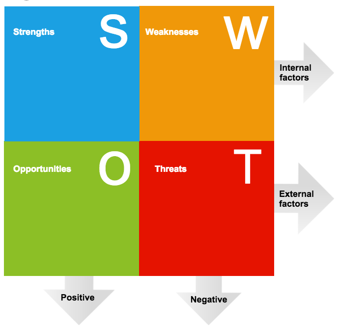

Chapter 4 
*********

SWOT Analysis and Recommendations
=================================

4.1 SWOT Analysis
-----------------

SWOT analysis is the detailed study of an organization’s exposure and potential in perspective of its strength, weakness, opportunity and threat. This facilitates the organization to make their existing line of performance and also foresee the future to improve their performance in comparison to their competitors. As though this tool, an organization can also study its current position, it can also be considered as an important tool for making changes in the strategic management of the organization.[10]

   [Figure 4.1] SWOT Analysis diagram

4.1.1 Strengths
---------------

  1. EXIM Bank of Bangladesh Limited has already established a favorable reputation in the banking industry of the country. It is one of the leading private sector commercial banks in Bangladesh. The bank has already shown a tremendous growth in the profits and deposits sector.
  2. EXIM Bank of Bangladesh Limited has provided its banking service with a top leadership and management position. The top management officials have all worked in reputed banks and their years of banking experience, skill, and expertise will continue to contribute towards further expansion of the bank.
  3. EXIM Bank of Bangladesh Limited has already achieved a high growth rate accompanied by an impressive profit growth rate in 2001. The number of deposits and the loans and advances are also increasing rapidly.
  4. EXIM Bank of Bangladesh Limited has the reputation of being the provider of good quality services too its, potential customers.

4.1.2 Weakness
--------------
  1. The main important thing is that the bank has no clear mission statement and strategic plan. The banks not have any long-term strategies of whether it wants to focus on retail banking or become a corporate bank. The path of the future should be determined now with a strong feasible strategic plan.
  2. The bank failed to provide a strong quality-recruitment policy in the lower and some mid level position. As a result the services of the bank seem to be Deus in the present days.
  3. The poor service quality has become a major problem for the bank. The quality of the service at EXIM Bank of Bangladesh Limited is higher than the Dhaka Bank, Prime Bank or Dutch Bangle Bank etc. But the bank has to compete with the Multinational Bank located here.

4.1.3 Opportunities
-------------------
  1. In order to reduce the business risk, EXIM Bank of Bangladesh Limited has to expand their business portfolio. The management can consider options of starting merchant banking or diversify into leasing and insurance sector.
  2. The activity in the secondary financial market has direct impact on the primary financial market. Banks operate in the primary financial market. Investment in the secondary market governs the national economic activity. Activity in the national economy controls the business of the bank.
  3. Opportunity in retail banking lies in the fact that the country’s increased population is gradually learning to adopt consumer finance. The bulk of our population is middle class. Different types of retail lending products have great appeal to this class. So, a wide variety of retail lending products has a very large and easily predicable market.
  4. A large number of private banks coming into the market in the recent time. In this competitive environment EXIM Bank of Bangladesh Limited must expand its product line to enhance its sustainable competitive advantage.

4.1.4 Threats
-------------
  1. All sustain multinational banks and upcoming foreign, private banks possess enormous threats to EXIM Bank of Bangladesh Limited. If that happens the intensity of competition will rise further and banks will have to develop strategies to compete against an on slough of foreign the banks.

  2. The default risks of all terms of loan have to be minimizing in order to sustain in the financial market. EXIM Bank of Bangladesh Limited has to remain vigilant about this problem so that proactive strategies are taken to minimize this problem if not elimination.

